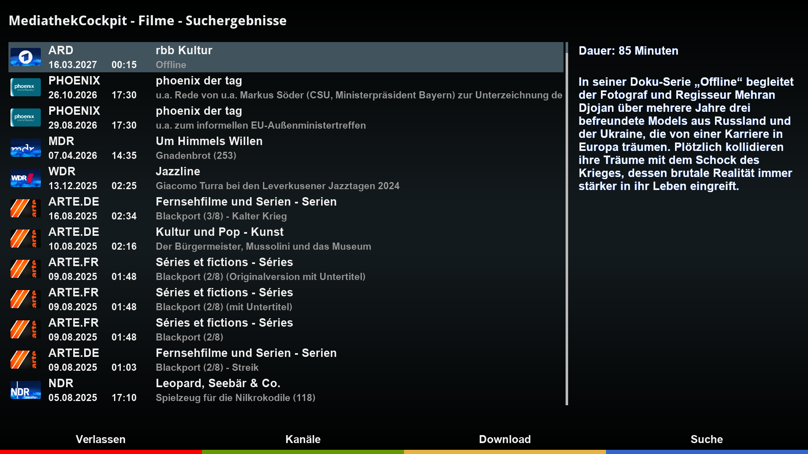
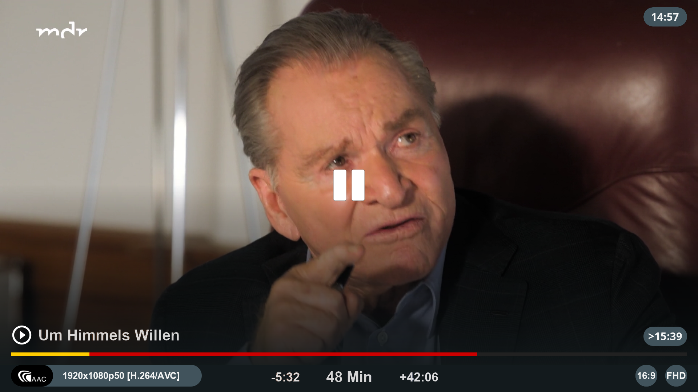
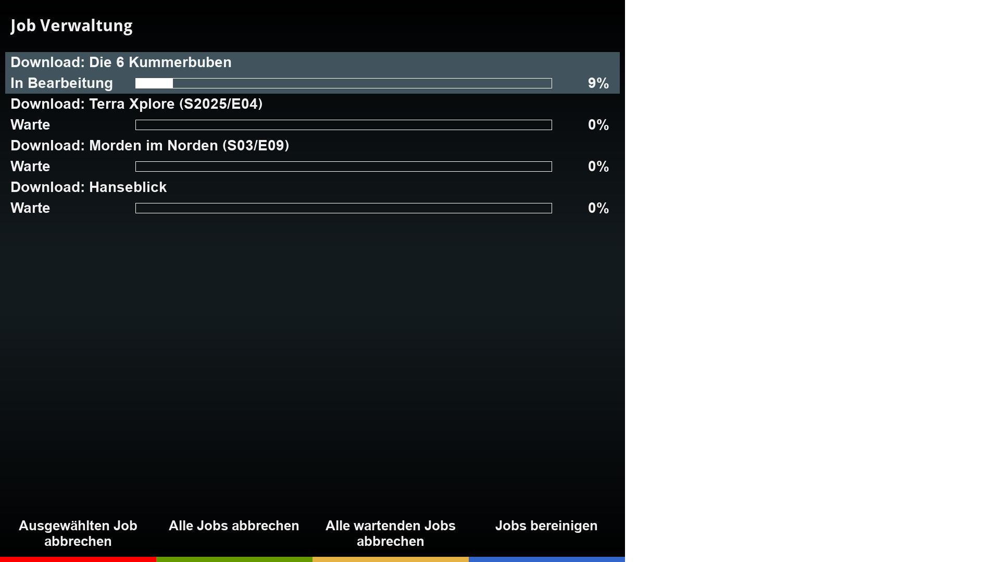
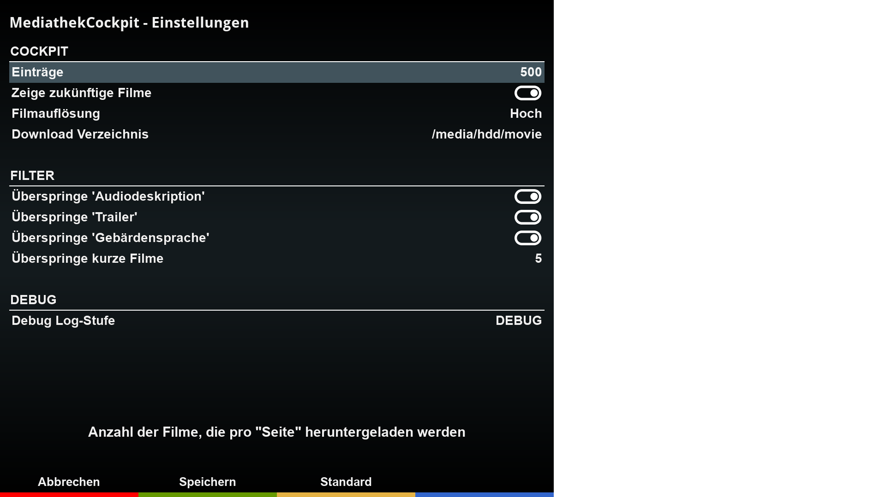

# MediathekCockpit (MTC)
Enigma2 plugin to browse Mediathek libraries and playback or download movies.

## Features
- Implements playback of media files as recording which gives the user full control like pause and skip forward/backward.
- Searches for media files manually or from EPG.
- Downloads Mediathek video files.
- Supports multiple video file downloads in parallel.
- Supports cover download.

## Languages
- english
- german

## Links
- Installation: https://xcentaurix.github.io/MediathekCockpit
- Support: https://github.com/xcentaurix/MediathekCockpit/discussions
